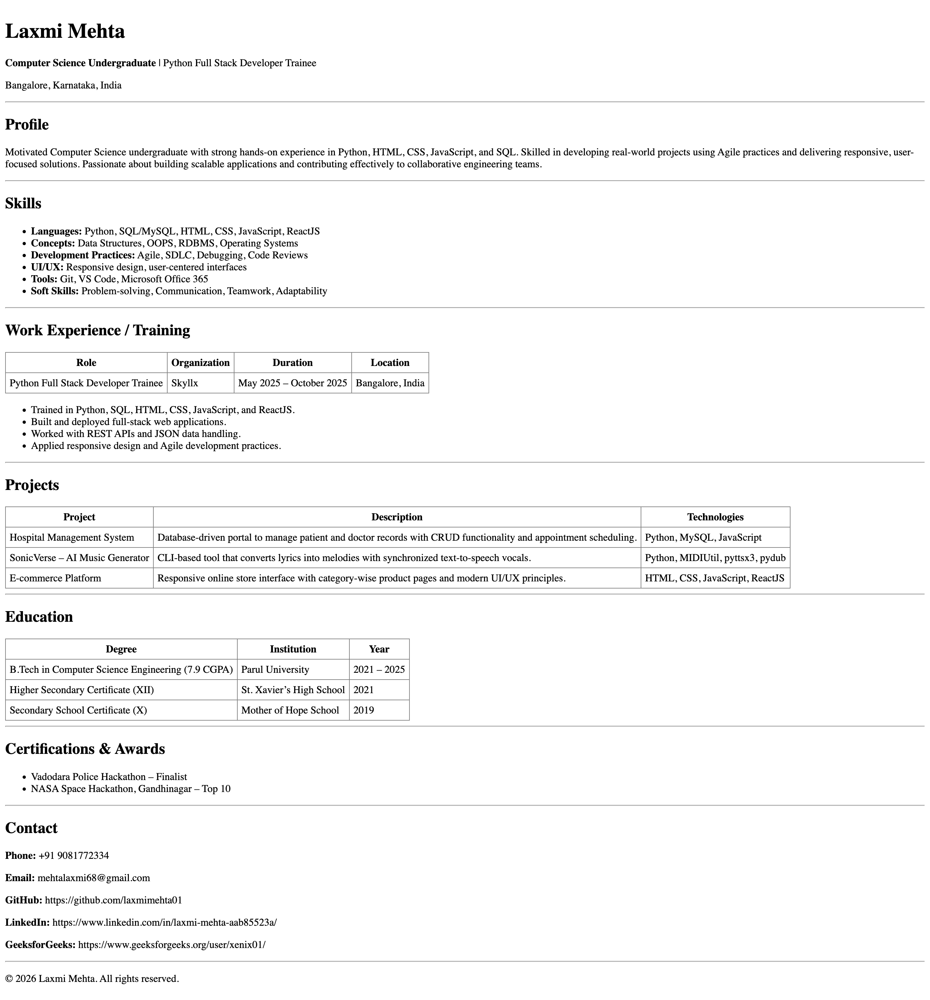

# HTML Resume Page

This repository contains a single-page resume website built using **pure HTML** as part of the **Web Dev Cohort 2026 – HTML Resume Page Assignment**.

The goal of this assignment is to create a clean, readable resume layout using proper HTML semantics.

---

## 📌 Assignment Details
- **Cohort:** Web Dev Cohort 2026  
- **Technology Used:** HTML only  

---

## 📄 Features
- Semantic HTML structure (`header`, `section`, `footer`)
- Clear sectioning: Profile, Skills, Experience, Projects, Education, Contact
- Proper use of lists and tables
- Consistent table layout with single-line borders
- Clean spacing and readability 

---

## 📸 Screenshot

Below is a screenshot of the rendered HTML resume:

